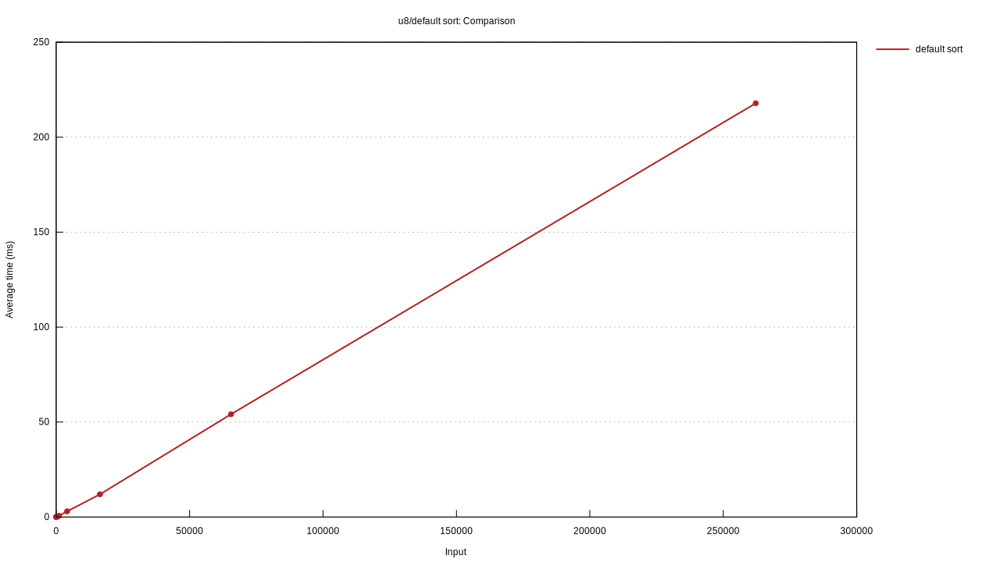

# Count Sort

A fast sorting library implementing count sort algorithm which is O(n + k). Designed for very quickly sorting large amounts of data with small range of possible values.

Currently only supports u8.

# Goals

Add support for more types including i8, u16 and i16

# Performance

| length | .sort()   | sort_u8   |
|--------|-----------|-----------|
| 1      | 254.34 ns | 2.9595 us |
| 4      | 311.05 ns | 3.4274 us |
| 16     | 1.0484 us | 6.0001 us |
| 64     | 14.810 us | 5.8646 us |
| 256    | 111.79 us | 10.524 us |
| 1024   | 632.43 us | 38.839 us |
| 4096   | 3.1092 ms | 82.978 us |
| 16384  | 11.990 ms | 303.39 us |
| 65536  | 52.786 ms | 945.06 us |
| 262144 | 219.08 ms | 4.2722 ms |

